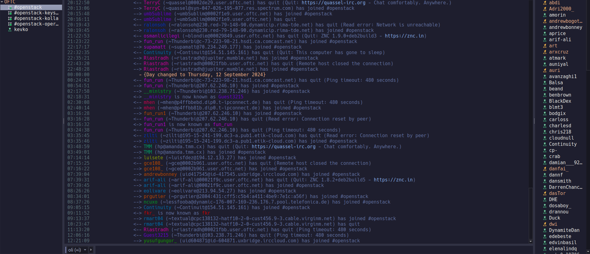

# Dracula for [Quassel](http://www.quassel-irc.org/)

> A Catppuchin-mocha theme for [Quassel](http://www.quassel-irc.org/) IRC client



## Install

If you are a git user, you can install the theme and keep up to date by cloning the repo:

    git clone https://github.com/0lzi/quassel.git

#### Install manually

Download
```bash
QCONFIG="XDG_CONFIG_HOME:-$HOME/.config/quassel-irc.org"
curl -L https://raw.githubusercontent.com/0lzi/quassel/main/cattpuchin-mocha.qss $QCONFIG

```
#### Activating theme

1.  Place the `cattpuchin-mocha.qss` file in your `~/.config/quassel-irc.org` folder
2.  Select and apply this theme via _Interface Settings_.


## Credits

This theme is a fork of [dracula/quassel](https://github.com/dracula/quassel)

For other stylesheets see [here](http://bugs.quassel-irc.org/projects/quassel-irc/wiki/Stylesheet_Gallery).

## License

[MIT License](./LICENSE)
